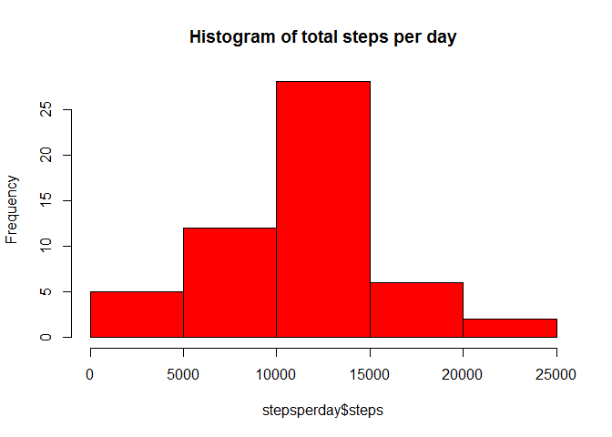
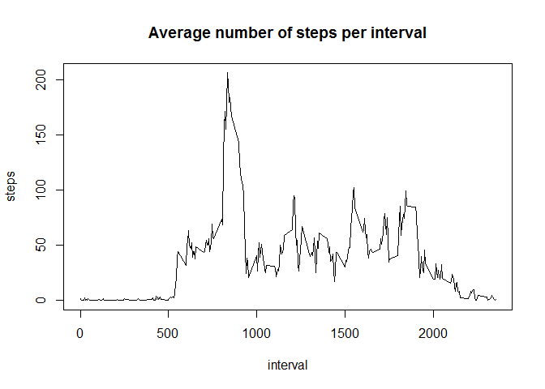
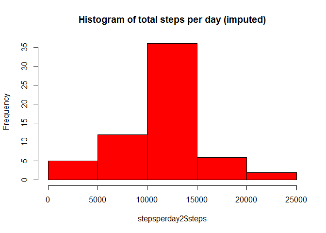
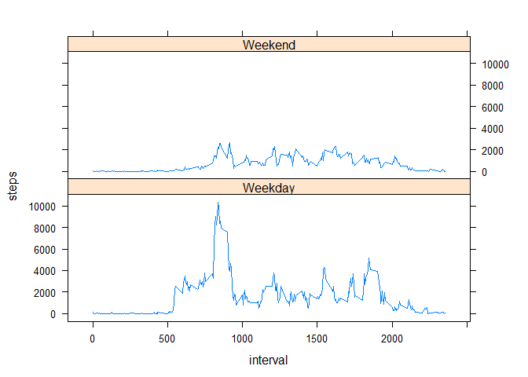

# Reproducible Research: Peer Assessment 1


## Loading and preprocessing the data
The csv file containing the data is in the working directory. We read it in and convert the date variable to type date.  


```r
filename <- "activity.csv"
data <- read.csv(filename)
data$date <- as.Date(data$date)
```

## What is mean total number of steps taken per day?
We will ignore the missing values in the dataset for now, so we remove them. 

```r
cleandata <- data[!is.na(data$steps),]
```

Now we calculate the total number of steps per day.

```r
stepsperday <- aggregate( steps ~ date, data = cleandata, sum)
head(stepsperday)
```

```
##         date steps
## 1 2012-10-02   126
## 2 2012-10-03 11352
## 3 2012-10-04 12116
## 4 2012-10-05 13294
## 5 2012-10-06 15420
## 6 2012-10-07 11015
```

We make a histogram of these values:

```r
hist(stepsperday$steps, col="red", main = "Histogram of total steps per day")
```

 

Finally, we calculate the mean and the median of the total number of steps per day: 

```r
totalmean <- mean(stepsperday$steps)
totalmedian <- median(stepsperday$steps)

cat("Total mean:", totalmean)
```

```
## Total mean: 10766.19
```

```r
cat("Total median:", totalmedian)
```

```
## Total median: 10765
```

## What is the average daily activity pattern?
First we will calculate the average number of steps for each interval (averaged over all days):

```r
meanstepsperinterval <- aggregate( steps ~ interval, data = cleandata, mean)
head(meanstepsperinterval)
```

```
##   interval     steps
## 1        0 1.7169811
## 2        5 0.3396226
## 3       10 0.1320755
## 4       15 0.1509434
## 5       20 0.0754717
## 6       25 2.0943396
```

Now, we plot these averages (against the interval): 

```r
plot(steps ~ interval, data = meanstepsperinterval, type = "l", main = "Average number of steps per interval")
```

 

As it turns out, the interval 835 shows the highest number of steps (on average). 


## Imputing missing values
We will now look more into the missing values. First, we calculate the total number of missing values:

```r
nobsmissing <- nrow(data[is.na(data$steps),])
nobsmissing
```

```
## [1] 2304
```

We will fill in the missing values with an appropriate estimate: the mean of the number of steps for that particular interval. 

```r
imputeddata <- data[,]
for (row in 1:nrow(imputeddata)) { 
        if(is.na(data$steps[row])){
                imputeddata$steps[row] = mean(data[data$interval == data$interval[row],"steps"], na.rm=T)
        }        
}
```

We will now again look at the distribution of the total number of steps per day. 

```r
stepsperday2 <- aggregate( steps ~ date, data = imputeddata, sum)
totalmean2 <- mean(stepsperday2$steps)
totalmedian2 <- median(stepsperday2$steps)
cat("Total mean:", totalmean2)
```

```
## Total mean: 10766.19
```

```r
cat("Total median:", totalmedian2)
```

```
## Total median: 10766.19
```

```r
hist(stepsperday2$steps, col="red", main = "Histogram of total steps per day (imputed)")
```

 

The mean and median for this corrected data set are very close to the non imputed values.   

## Are there differences in activity patterns between weekdays and weekends?
First we will create a new factor, indicating weekday or weekend. 

```r
imputeddata$daytype <- as.factor(ifelse(weekdays(imputeddata$date) %in% c("Saturday", "Sunday"), "Weekend", "Weekday"))
```

Now we will make a plot showing the total number of steps per day plotted against the interval, for both weekend and weekdays: 


```r
stepsperday3 <- aggregate( steps ~ interval + daytype, data = imputeddata, sum)
library(lattice)
xyplot(steps ~interval | daytype ,data = stepsperday3,type = "l", layout = c(1,2) )
```

 

As we see, the behaviour in weekends seems to be quite different, primarily less active. 
